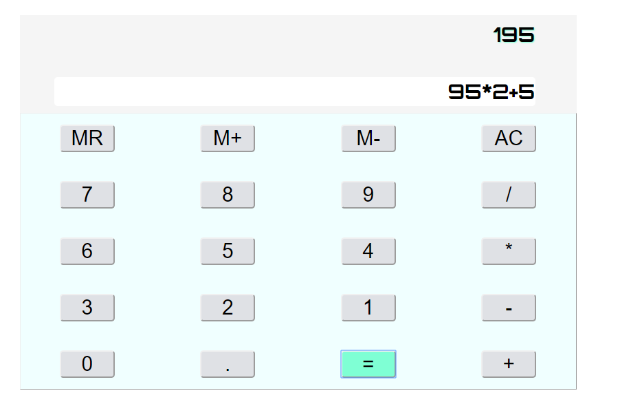

## Vanilla TO DO APP

**_TO DO app in Vanilla Javascript and HTML + CSS_**

### Summary

Second app done in my roadmap to become a fullstack web developper.
You can create, mark as complete and delete a task.

I learned a lot during the development of the app. Some of the concepts i used are closures and data persisting with Local Storage.
